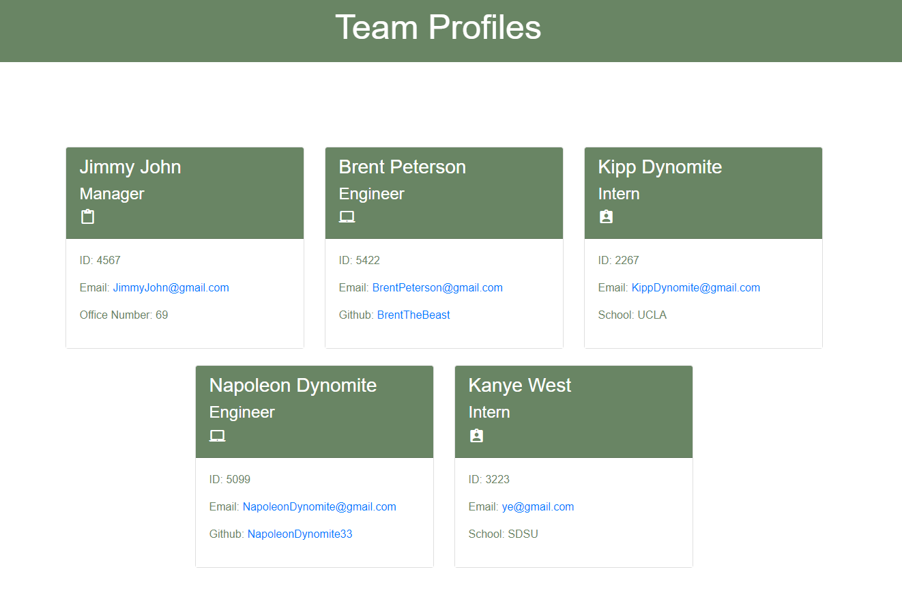

# Team Profile Generator
## Description 

My motivation for this project was to build a team profile generator that displays temperature, wind, humidity, and the UV index. Constructing a team profile generator is helpful for many coders as it is a typical interview project. This project helped me learn more about JavaScript and node. I built this project to test my JavaScript and node skills. One of the major struggles I had with the team profile generator was getting node to work properly. It took a lot of reading and watching YouTube tutorials. I feel accomplished that I finally finished this project after it took me so long. 

## Table of Contents

- [Installation](#installation)
- [Usage](#usage)
- [Credits](#credits)
- [License](#license)

## Installation

- Follow the instuction video under usage
- First add manager
- Type y to proceed with more employees or n to finish it 

## Usage
    
A sample of the working program.

A video of the working program.

## License

[MIT-License](./LICENSE)

## Badges

